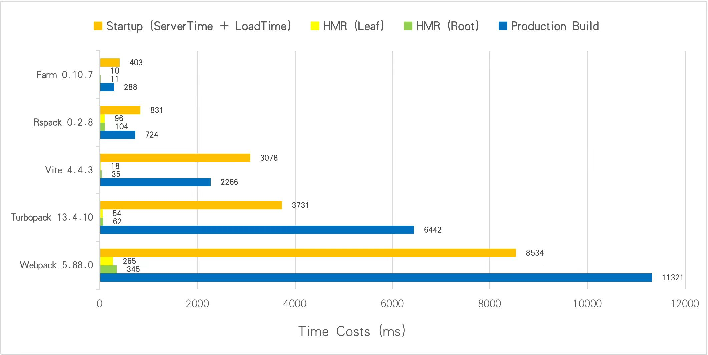

# performance-compare

Benchmarks for Farm, Webpack, Vite, Rspack and Turbopack.

> Using Turbopack's bench cases (1000 React components), see https://turbo.build/pack/docs/benchmarks

|           | **Startup** | **HMR (Root)** | **HMR (Leaf)** | **Production Build** |
| --------- | ----------- | -------------- | -------------- | -------------------- |
| Webpack   | 8035ms      | 345ms          | 265ms          |        11321ms              |
| Vite      | 3078ms      | 35ms           | 18ms           |        2266ms              |
| Turbopack | 3731ms      | 62ms           | 54ms           |          6442ms            |
| Rspack    | 831ms       | 104ms          | 96ms           |          724ms            |
| Farm      | 403ms       | 11ms           | 10ms           |           288ms           |



Run benchmarks:

```bash
node benchmark.mjs
```

You will see something like:

```txt
bright@bright-MS-7D17:~/opensource/performance-compare$ node benchmark.mjs

Rspack  startup time: 417ms
Turbopack  startup time: 2440.673095703125ms
Webpack  startup time: 7968ms
Vite  startup time: 3712ms
Farm  startup time: 430ms
Turbopack  Root HMR time: 7ms
Farm  Root HMR time: 7ms
Vite  Root HMR time: 42ms
Rspack  Root HMR time: 298ms
Webpack  Root HMR time: 451ms
Farm  Leaf HMR time: 10ms
Turbopack  Leaf HMR time: 11ms
Vite  Leaf HMR time: 22ms
Webpack  Leaf HMR time: 284ms
Rspack  Leaf HMR time: 303ms
```

If you want to start the project with the specified tool, try:

```bash
pnpm i # install dependencies

npm run start # Start Farm
npm run start:vite # Start Vite
npm run start:webpack # Start Webpack
npm run start:rspack # Start Rspack
npm run start:turbopack # Start Turbopack
```
