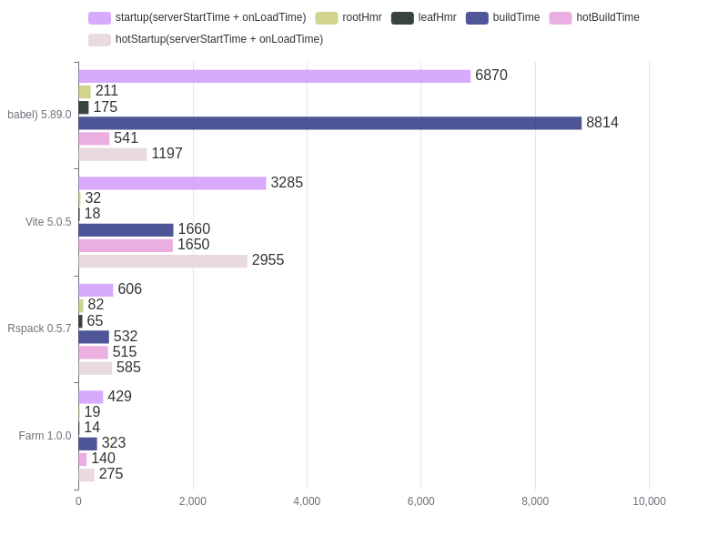
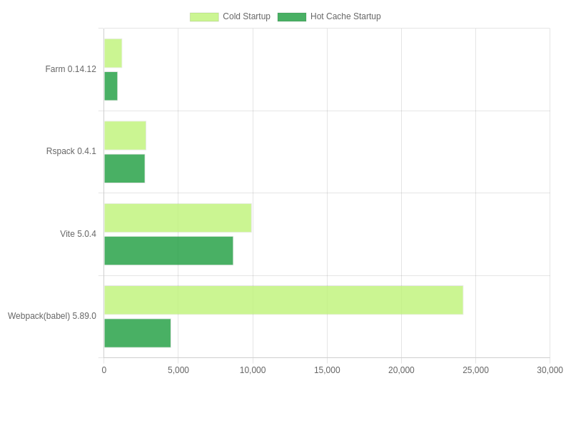
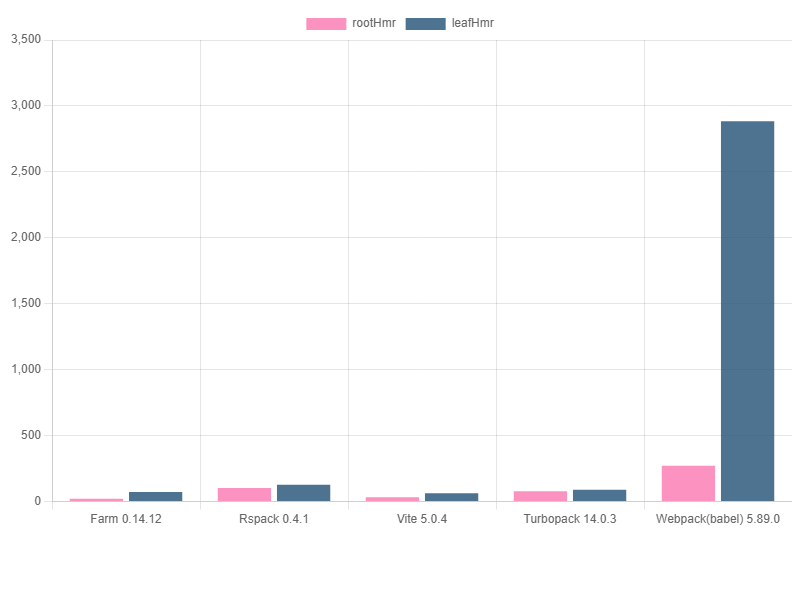
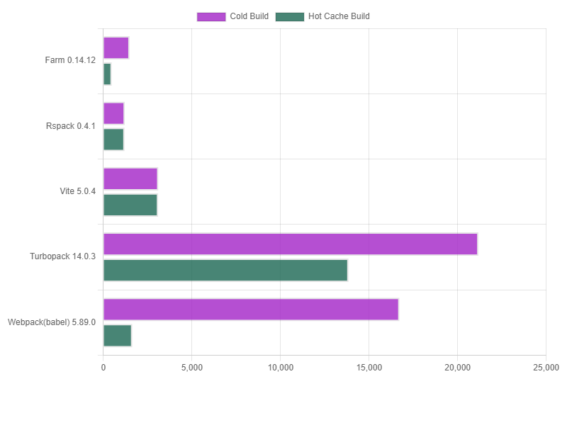

# performance-compare

Benchmarks for [Farm](https://github.com/farm-fe/farm), Rsbuild, Webpack, Vite

> Using Turbopack's bench cases (1000 React components), see https://turbo.build/pack/docs/benchmarks

> The `startup time` algorithm is the compilation time plus the time from browser loading to page rendering on the browser

> [!IMPORTANT]
> **Tips:** 
Farm compiled a write with incremental cache for the first time, The time to write the cache in the current warehouse module configuration is approximately 200ms,
Rsbuild currently has no caching mechanism, so we provide second pass compilation data by default
Later, we can wait for rspack to implement incremental caching and then we can re-separate the entire data,(the second compilation with caching and the first compilation without caching)

<!-- > Tested on Linux Mint, 11th Gen Intel(R) Core(TM) i5-11400 @ 2.60GHz, 16GB -->
> Tested on Macos M1 Pro

|            framework        | startup | serverStartTime | onLoadTime | rootHmr | leafHmr | buildTime |
|-------------------------------|---------------------------------------|-----------------|------------|---------|---------|-----------|
|          Farm 1.3.22           |                481ms               |     322ms     |  159ms   | 32ms  | 44ms  |  651ms  |
|       Farm 1.3.22 (Hot)        |                258ms               |     120ms     |  138ms   | 27ms  | 45ms  |  210ms  |
|        Rsbuild 1.0.5         |                417ms                |     250ms     |  167ms   | 82ms  | 85ms  |  320ms  |
|     Rsbuild 1.0.5 (Hot)      |                382ms               |     210ms     |  172ms   | 111ms  | 74ms  |  280ms  |
|    Vite 6.0.0-alpha (swc)     |               1716ms                |     142ms     |  1574ms  | 114ms  | 123ms  | 1260ms  |
|  Vite 6.0.0-alpha (swc)(Hot)  |               1077ms                |     114ms     |  963ms  | 34ms  | 17ms  | 1340ms  |
|   Vite 6.0.0-alpha (babel)    |               2838ms                |     126ms     |  2712ms  | 28ms  | 28ms  | 1390ms  |
| Vite 6.0.0-alpha (babel)(Hot) |               2563ms                |     111ms     |  2452ms  | 138ms  | 122ms  | 1310ms  |
|     Webpack 5.91.0 (swc)      |               1926ms                |    1591ms     |  335ms   | 588ms | 158ms | 4144ms  |
|   Webpack 5.91.0 (swc)(Hot)   |                851ms                |     557ms     |  294ms   | 242ms | 216ms |  483ms  |
|    Webpack 5.91.0 (babel)     |               5607ms                |    5307ms     |  300ms   | 226ms | 171ms |  460ms  |
|  Webpack 5.91.0 (babel)(Hot)  |               1083ms                |     827ms     |  256ms   | 260ms | 163ms |  481ms  |


### Full Benchmark


### StartUp Benchmark


### HMR Benchmark


### Production Build Benchmark


Run benchmarks:

```bash
node benchmark.mjs
```

You will see something like:

```txt
bright@bright-MS-7D17:~/opensource/performance-compare$ node benchmark.mjs

Rspack  startup time: 417ms
Turbopack  startup time: 2440.673095703125ms
Webpack  startup time: 7968ms
Vite  startup time: 3712ms
Farm  startup time: 430ms
Turbopack  Root HMR time: 7ms
Farm  Root HMR time: 7ms
Vite  Root HMR time: 42ms
Rspack  Root HMR time: 298ms
Webpack  Root HMR time: 451ms
Farm  Leaf HMR time: 10ms
Turbopack  Leaf HMR time: 11ms
Vite  Leaf HMR time: 22ms
Webpack  Leaf HMR time: 284ms
Rspack  Leaf HMR time: 303ms
```

If you want to start the project with the specified tool, try:

```bash
pnpm i # install dependencies

npm run start # Start Farm
npm run start:vite # Start Vite
npm run start:webpack # Start Webpack
npm run start:rspack # Start Rspack
npm run start:turbopack # Start Turbopack
```
